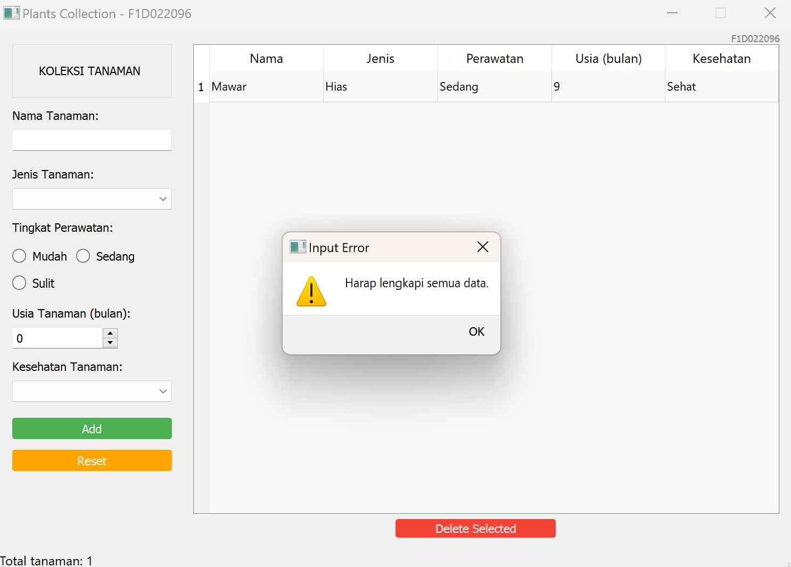

# Assignment Week 7

<table align="center">
  <tr>
    <td align="center">
       
      <b>Tampilan desain UI yang dibuat menggunakan Qt Designer.</b>
    </td>
    <td align="center">
       
      <b>Tampilan awal ketika di run.</b>
    </td>
  </tr>
  <tr>
    <td align="center">
       
      <b>Tampilan ketika sebelum menambahkan tanaman ke dalam tabel.</b>
    </td>
    <td align="center">
       
      <b>Tampilan ketika sesudah menambahkan tanaman ke dalam tabel.</b>
    </td>
  </tr>
  <tr>
    <td align="center">
       
      <b>Tampilan ketika sebelum meng-klik tombol reset.</b>
    </td>
    <td align="center">
       
      <b>Tampilan ketika sesudah meng-klik tombol reset.</b>
    </td>
  </tr>
    <tr>
    <td align="center">
       
      <b>Tampilan ketika sebelum menghapus sebaris kolom yang ada pada tabel.</b>
    </td>
    <td align="center">
       
      <b>Tampilan ketika sesudah menghapus sebaris kolom yang ada pada tabel.</b>
    </td>
  </tr>
  <tr>
    <td align="center">
       
      <b>Tampilan ketika belum lengkap mengisi data tanaman.</b>
    </td>
    <td align="center">
       
      <b>Tampilan ketika tidak memilih kolom yang ingin dihapus.</b>
    </td>
  </tr>
</table>
